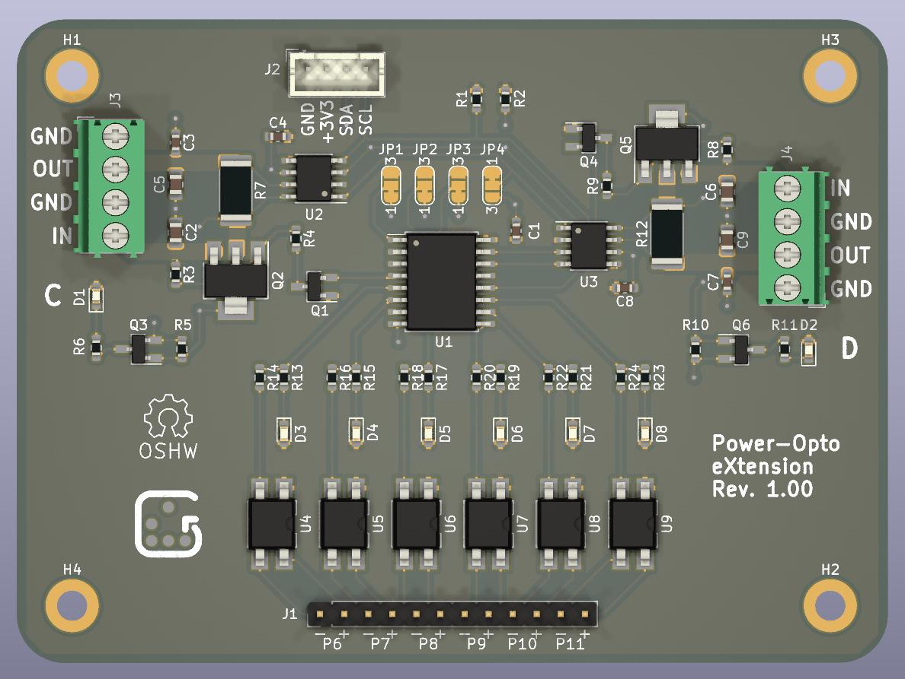

# POX - Power-Opto Extension Board (KiCad PCB)

This is a small extension board to control operation of two development boards,
e.g. on your desk, or in a board farm.  It is mainly intended for use with
BCU/2 (https://github.com/geertu/pcb-bcu2), but it can be used with any
microcontroller or single-board computer that has a compatible I2C interface.

## Features

  - Controlled over I2C,
  - Two power control and measurement channels (3.3-14V, max. 3.2A),
  - Six opto-isolators for e.g. reset, wake-up, and keypress simulation.

## Software

Software to run on BCU/2+POX is available from
https://github.com/geertu/teensy3-bcu2/tree/bcu2%2Bpox in source form.

## License

CC-BY-SA-4.0 (https://creativecommons.org/licenses/by-sa/4.0/)

## PCB and Parts

PCB and parts can be ordered at
https://aisler.net/geert/power-opto-extension/bcu2-pox (Disclaimer: I'm not
affiliated to AISLER). Note that the project at Aisler predates the change from
NTF6P02 to DMP6023LE-13.

## Bill Of Materials

  - C1, C3, C4, C7, C8: Capacitor, 100nF, SMD 0603/1608
  - C2, C5, C6, C9: Capacitor, 10µF, SMD 0805/2012, 25V
  - D1, D2: LED Green clear, SMD 0603/1608
  - D3-D8: LED Yellow clear, SMD 0603/1608
  - J1: Male 1x12 header 2.54mm
  - J2: Male 1x4 header, RM 2mm, e.g. JST B4B-PH-K
  - J3, J4: Screw type, terminal block, RM 3.5mm
  - Q1, Q3, Q4, Q6: MOSFET N-channel 60V 115mA, SOT23-3
  - Q2, Q5: MOSFET P-channel e.g. 60V 7A (DMP6023LE-13) or
				  20V 10A (NTF6P02), SOT223
  - R1, R2: Resistor, 4.7kΩ, SMD 0603/1608 (optional, I2C pull-ups)
  - R3, R8: Resistor, 47kΩ, SMD 0603/1608
  - R4, R9: Resistor, 10kΩ (when using DMP6023LE-13) or
		      47kΩ (when using NTF6P02), SMD 0603/1608
  - R5, R10: Resistor, 100kΩ, SMD 0603/1608
  - R6, R11, R13, R15, R17, R19, R21, R23: Resistor, 1kΩ, SMD 0603/1608
  - R7, R12: Resistor, 100mΩ, SMD 2512/6432, 1%, 2W
  - R14, R16, R18, R20, R22, R24: Resistor, 270Ω, SMD 0603/1608
  - U1: PFC8574, 16-SOIC (wide)
  - U2, U3: INA219xID power monitor, 8-SOIC
  - U4-U9: Opto-isolator, Mini-Flat-4, e.g. Broadcom HCPL-181-00CE

## Connector Pinouts

  - J1: Opto-isolator channels 6-11

    Pin               | Function
    ----------------- | --------
     1-11 (odd pins)  | Emitter ("negative output")
     2-12 (even pins) | Collector ("positive output")

  - J2: I2C[A]

    Pin | Function
    --- | --------
     1  | GND
     2  | +3.3V
     3  | SDA
     4  | SCL

  - J3 / J4: Power channels C & D

    Pin | Function
    --- | --------
     1  | GND
     2  | Power OUT
     3  | GND
     4  | Power IN (3.3-14V, max. 3.2A)

## Solder Jumpers

  - JP1 / JP2 / JP3: Configure the I2C address of the PCF8574 I/O expander
    (0x20 (default) to 0x27)

  - JP4: Configure the I2C addresses of the two INA219 power monitors
    (0x44/0x45 (default) or 0x40/0x41)

## Footnotes

  * [A] Pin order of the I2C connector is similar (but reversed!) to the Seeed
	Studio Grove and SparkFun Qwiic Connect systems, although the connector
	used is different (you can probably mount a real Grove connector
	instead).
